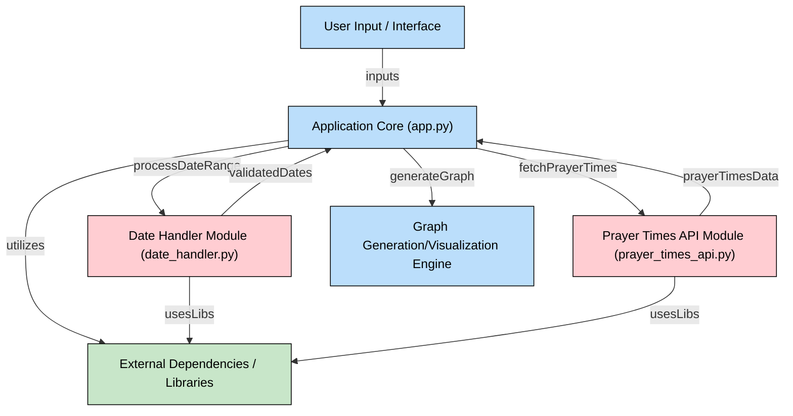

# SalahGraph
This project was created to help individuals visualize prayer times throughout the year. By inputting a location 
and date range, users can generate customized graphs to better understand daily prayer schedules.

### Why This Project Was Created
Muslims around the world follow specific prayer times that change daily based on the location and time of the year. 
This app provides a simple way to visualize these changes, helping individuals plan their routines throughout the 
year, and muslim organizations/mosques plan their prayer schedules throughout the year.

### Features
- Generate prayer time graphs for any date range.
- Customizable graph titles, styles, and labels.
- Support for various locations worldwide.
- Incorporates time changes due to DST.

### Future Improvements
- Integration with geolocation services for automatic location detection.
- Enhanced styling options for the graphs.

### Repo Diagram

